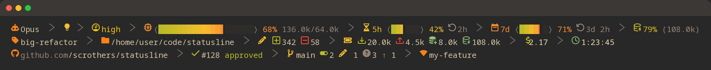
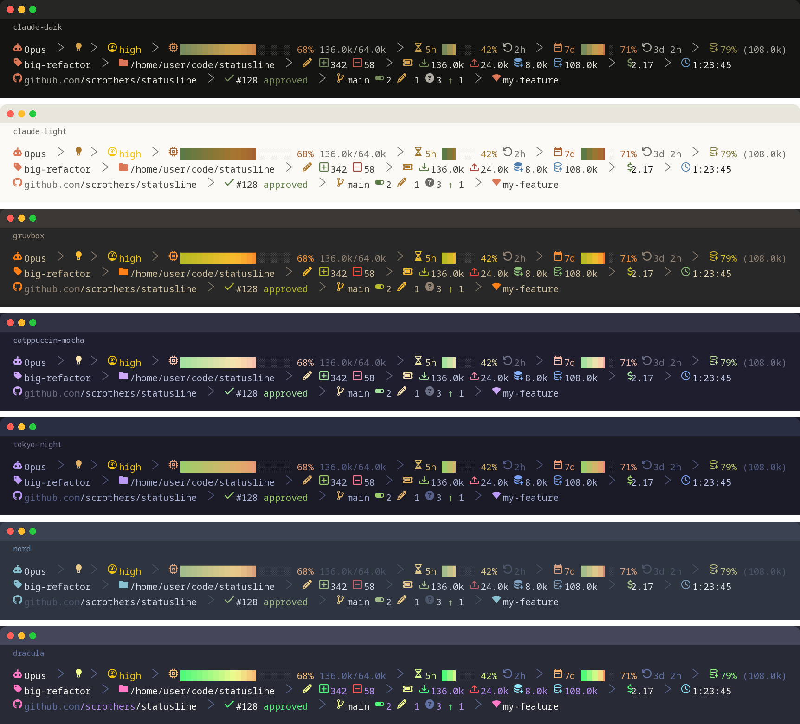

# statusline

<p align="center">
  
</p>

<p align="center">
  <a href="https://github.com/scrothers/statusline/actions/workflows/ci.yml"></a>
  <a href="https://github.com/scrothers/statusline/actions/workflows/codeql.yml"></a>
  <a href="https://pkg.go.dev/github.com/scrothers/statusline"></a>
  <a href="LICENSE.md"></a>
</p>

A single-binary, themeable [Claude Code statusLine](https://code.claude.com/docs/en/statusline)
command written in Go. Flat, no-background segments joined by a thin Nerd
Font chevron divider, truecolor gradients, seven built-in themes, and an
optional TOML config file for anyone who wants to tweak it further.

*(The image above is a real render — `statusline demo --theme claude-dark --scenario full` —
captured as an image since GitHub can't render truecolor ANSI escape codes or
Nerd Font glyphs inside a Markdown code block.)*

## Contents

- [Install](#install)
- [Preview it](#preview-it)
- [Configure Claude Code](#configure-claude-code)
- [Segments](#segments)
- [Themes](#themes)
- [Configuration](#configuration)
- [Requirements](#requirements)
- [Development](#development)
- [Contributing](#contributing)
- [Security](#security)
- [License](#license)

## Install

From source:

```sh
git clone https://github.com/scrothers/statusline.git
cd statusline
make build      # produces ./statusline
```

Or, once a release exists:

```sh
go install github.com/scrothers/statusline/cmd/statusline@latest
```

## Preview it

`statusline demo` renders built-in sample payloads directly — no need to
craft JSON fixtures or wire up Claude Code first:

```sh
./statusline demo                                   # "full" scenario, all 7 themes
./statusline demo --theme dracula                    # one theme only
./statusline demo --theme nord --scenario minimal    # early-session look
./statusline demo --scenario narrow --columns 40     # test width-based truncation
```

Scenarios: `minimal` (early session, no git repo yet), `full` (every segment
at once — dirty repo, open PR, context/cost/rate-limit/cache data, a named
session, a worktree), `narrow` (the `full` payload rendered at 30 columns, to
see which segments drop first).

## Configure Claude Code

Add to `~/.claude/settings.json`:

```json
{
  "statusLine": {
    "type": "command",
    "command": "~/code/statusline/statusline",
    "padding": 2,
    "refreshInterval": 2,
    "hideVimModeIndicator": true
  }
}
```

- `refreshInterval: 2` keeps the clock-style duration, cost, and context bar
  ticking during long idle stretches (a slow tool call, a background
  subagent), not just after each assistant message.
- `hideVimModeIndicator: true` suppresses Claude Code's built-in
  `-- INSERT --` text, since the vim badge already shows the mode when
  enabled in config (see [Segments](#segments)).

## Segments

Three lines, each answering one question. Every segment is plain colored
text — no background is ever painted, so lines read as flat, breathing text
joined by a thin chevron divider, not powerline pills.

| Line | Segments | Notes |
|---|---|---|
| 1 — Claude | model, provider badge, thinking, effort, context window, rate limits (5h/7d), cache | The model's own state: what it's running, how hard, and how much room/budget is left. |
| 2 — session | session name, directory, lines added/removed, token counts, cost, duration | Omitted fields (no custom name, no diff yet) just don't appear. |
| 3 — git | repo (host/owner/name), open PR (number + review state), branch + status, worktree | The whole line disappears outside a git repository. |

Segments not in the default layout but still available via custom config:
`vim` (vim mode), `agent` (subagent name), `output_style`. These render with
no background either — they just aren't wired into any line by default.

Under width pressure, segments drop in priority order (lowest first) until
a line fits; model and directory never drop, only self-truncate.

`model`'s icon is colored per model family — Opus, Sonnet, Haiku, Fable, and
Mythos each get their own theme-defined accent (see [Themes](#themes))
instead of one flat color, so the tier you're running is visible at a
glance; an id that doesn't decode to one of those five falls back to the
theme's general identity accent.

`provider` renders a small badge next to `model` (AWS/GCP/Azure/Router/Gateway
icon) identifying which route the model traffic took, resolved in three
tiers:

1. An explicit `provider = "aws"`/`"gcp"`/`"azure"`/`"router"`/`"gateway"` in
   config always wins.
2. Otherwise, Claude Code's own routing environment variables (inherited
   from the parent process) — `CLAUDE_CODE_USE_BEDROCK`/`ANTHROPIC_BEDROCK_*`/
   `ANTHROPIC_AWS_*` for AWS, `CLAUDE_CODE_USE_VERTEX`/`ANTHROPIC_VERTEX_*`
   for GCP, `ANTHROPIC_FOUNDRY_*` for Azure, or a non-default
   `ANTHROPIC_BASE_URL` for a generic corporate/self-hosted gateway. This is
   the only reliable way to detect Azure or a bare corporate-relayed id —
   neither carries any distinguishing shape in `model.id` itself (a gateway
   that just relays a renamed id like `claude-4-8-opus` is structurally
   identical to a legitimate legacy Anthropic id like `claude-3-opus`).
3. Last resort: the `model.id` shape itself — a Bedrock `anthropic.` prefix
   or ARN, a Vertex `@date` suffix or resource path, or a `vendor/model`
   prefix from an OpenRouter-style aggregator.

Silent when none of the three find anything, which is the common
plain-first-party case.

`effort` is the one segment colored by intensity rather than theme: its icon
escalates from an empty gauge (`low`) through a full gauge (`xhigh`) to fire
(`max`) and an alert fire (`ultra`), and its color runs a fixed green → red →
purple scale independent of the active theme, so "getting hotter" reads the
same everywhere.

`context_window` and the two `ratelimit_*` gauges share the same bar
treatment: `context_window`'s width scales with the detected terminal width
(clamped between 8 and 24 cells); the rate-limit bars stay a fixed, narrower
6 cells and are explicitly labeled `5h`/`7d` so the two aren't
distinguishable by icon alone. On all three, each bar cell's color is fixed
by its position along the bar — green on the left sliding through warning
to danger on the right — so filling the bar reveals more of a stable
on-screen gradient from the left rather than shifting every already-filled
cell's color together each time the percentage changes. (Each gauge's icon
and percentage text use a separate smooth gradient based on its own overall
percentage.) The context bar also shows a `used/remaining` token count next
to the percentage whenever the context window size is known.

Each `ratelimit_*` gauge also shows a muted reset countdown (a restart icon
plus a compact "resets in" duration like `2h` or `3d 2h`) whenever the
payload reports a reset time — a coarser, more actionable signal than the
percentage alone, since it tells you when the budget actually comes back
rather than just how much is used right now.

`cache` reuses that same smooth gradient for its icon and hit-rate
percentage, but inverted: a high cache-hit rate is good, so it runs green at
100% down to red at 0% (the opposite direction from the gauges above, where
high usage is the thing to watch). The raw cache-read count in parentheses
stays a plain muted color.

`lines_changed` leads with a pencil icon (given two trailing spaces of its
own, since its glyph reads tight against a following icon), then
diff-added/diff-removed icons that alone carry the +/- meaning. `token_counts`
leads with a ticket icon (same two-space treatment) and breaks down usage
into four counts, each behind its own icon: an inbound tray for input
tokens, an outbound tray for output tokens, a database-plus for
cache-creation tokens, and the same cache icon used elsewhere for
cache-read tokens. Input/output are session-cumulative totals — the same
time scope as `lines_changed`'s add/remove counts — while cache-creation/
cache-read come from the most recent API response, since the schema has no
cumulative field for either and "how well is caching working right now" is
inherently a per-turn question anyway (the same time scope the standalone
`cache` segment already uses). In both segments, only the icons carry
semantic color (green/red for add-remove and input-output, info for the
cache pair); the counts themselves are always the theme's secondary text
color, with no ASCII sign.

`cost` and `duration` follow the same icon/text split: the dollar icon is
success-green (money) and the clock icon is info, while the amount and the
clock-style duration both render in the theme's primary text color — plain
prose, not a semantic accent, since a dollar figure or elapsed time isn't
inherently good/bad/informational the way a gauge fill is.

Line 3 follows the same rules as everywhere else. `git`'s status badges
(staged/modified/untracked/conflicts/ahead/behind) each split into a
category-colored icon and a `TextSecondary` count, matching
`lines_changed`/`token_counts`; conflicts use a proper alert icon rather
than a bare `!`. The branch name, `repo`'s final `/name` piece, `pr`'s
number, and `worktree`'s name all use `IdentityText` — the same "headline
label following an identity-colored icon" role as `model`/`directory`/
`session_name` — while `pr`'s icon and review-state word still share the
review-state color, since that state is the actual signal.

`repo`'s icon is host-branded: GitHub, GitLab, and Forgejo each get their
own logo when the remote host contains that name (matching public domains
like `github.com` and enterprise/self-hosted ones like
`github.company.com` alike), falling back to a generic git icon for
anything else — including Forgejo instances with no "forgejo" in their
hostname (e.g. Codeberg), since the host string is the only signal
available.

## Themes

Seven built-in themes, selected with `theme = "<name>"` in config or
`--theme <name>` on the command line. `claude-dark` is the default. Themes
are foreground-only palettes (identity accent + per-model-family identity
accents (`identity_opus`/`identity_sonnet`/`identity_haiku`/`identity_fable`/
`identity_mythos`) + success/warning/danger/info/muted roles) — there's no
background token, since the statusline never paints one. Every color token,
including the per-family ones, can be overridden individually via
`[theme_overrides]` (see [Configuration](#configuration)).

<p align="center">
  
</p>

| Name | Style |
|---|---|
| `claude-dark` | Anthropic's coral/terracotta accent on a warm near-black ink background (default) |
| `claude-light` | The same coral/terracotta accent on a warm cream background — the one built-in theme meant for a light terminal |
| `gruvbox` | Warm, retro, high-contrast |
| `catppuccin-mocha` | Soft pastel-on-dark |
| `tokyo-night` | Cool blues/purples on near-black |
| `nord` | Arctic blues |
| `dracula` | High-contrast purple/pink |

`claude-dark` and `claude-light` are built from Anthropic's published brand
palette (the `#D97757` coral, `#141413` ink, `#FAF9F5` cream, plus a sage
green and dusty blue used for `success`/`info`); `warning` and `danger`
aren't part of that palette, so they're original colors chosen to sit
comfortably in the same warm, muted family rather than clashing with a
generic bright red/yellow.

## Configuration

Optional TOML config file, discovered in this order (first match wins):

1. `--config <path>` flag
2. `$XDG_CONFIG_HOME/statusline/config.toml` (or `~/.config/statusline/config.toml`)
3. `~/.claude/statusline-config.toml`
4. Built-in defaults (Gruvbox theme, the 3-line layout above)

A missing or malformed config file is never fatal — it falls back to the
built-in default and prints a warning to stderr (never stdout, which is
reserved for the rendered statusline).

Example overriding the theme and disabling one segment:

```toml
theme = "nord"

[segments.pr]
enabled = false

[theme_overrides]
success = "#00ff00"
```

Take over `lines[].segments` entirely to reorder, drop, or add segments —
see the [Segments](#segments) table for every available ID:

```toml
[[lines]]
enabled = true
segments = ["model", "context_window", "cache"]
```

## Requirements

- A [Nerd Font](https://www.nerdfonts.com/) in your terminal for the icons
  and the divider glyph. Without one, set `nerd_font = false` in config to
  fall back to plain Unicode/ASCII for every icon.
- `git` on `PATH` for the repo/branch/PR segments; everything else works
  without it.

## Development

```sh
make build             # go build -> ./statusline
make test              # unit tests
make test-integration  # + real git subprocess tests
make test-e2e          # + builds and drives the real binary
make bench             # benchmarks for the render/parse/config/theme hot paths
make lint              # go vet + golangci-lint
make security          # govulncheck + gosec
```

The whole non-git-subprocess render path — JSON decode, config/theme load,
and the full three-line render — benchmarks at roughly 1.3ms combined on
modest hardware, comfortably inside the sub-100ms-per-invocation budget the
design targets; `internal/gitstatus`'s porcelain parser alone handles a
500-file working tree in well under a millisecond.

## Contributing

Bug reports, feature requests, and pull requests are welcome — see
[CONTRIBUTING.md](CONTRIBUTING.md) for the development workflow and what to
check before opening a PR. This project follows the
[Contributor Covenant](CODE_OF_CONDUCT.md).

## Security

See [SECURITY.md](SECURITY.md) for supported versions and how to report a
vulnerability privately. Please don't file a public issue for security
reports.

## License

Apache License 2.0 — see [LICENSE.md](LICENSE.md).
